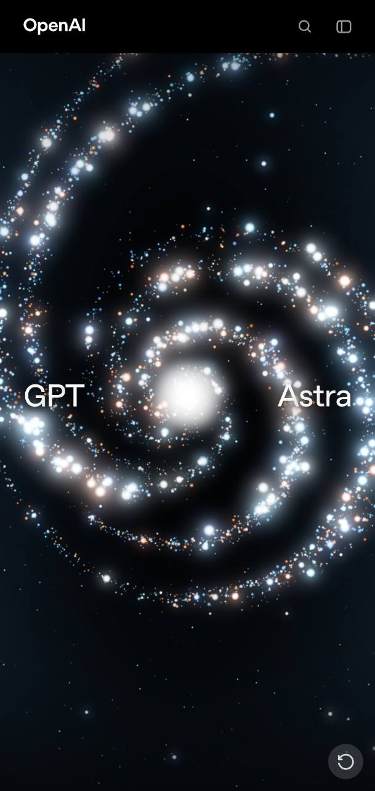

# Fireflies — summer night

## Confirmed intention

An abstract summer night: deep, enveloping blue, calm, soft, organic, and luminous. The visitor should feel surrounded by living lights.

The owner accepts the layered particle and coherent color proposals as a starting direction, to refine through visual comparisons. Exact colors, intensity, density, and depth treatment are not locked.

## Starting visual direction

- Distant, subdued lights; precise living particles forming the word; occasional larger, softer foreground lights.
- Explore warm ivory, pale gold, and subtle green-gold together against the deep blue night.
- Mix related colors within depth layers rather than using a fixed color for each layer.
- Combine fine points, brighter cores, and restrained soft halos. Preserve darkness and the word's readability.

This is an accepted exploration direction, not a final palette or rendering specification. Summer is an emotional setting, not a requirement for a realistic landscape.

## Reference 01 — luminous particles

- **Source:** screenshot supplied by the owner on 2026-10-06; visible OpenAI branding. Original page URL, authorship, and reuse rights are unverified.
- **Purpose:** visual research for particle texture and depth; not a production asset.
- **Retain:** varied sizes and sharpness, fine points alongside luminous cores and soft halos, uneven density, dark negative space.
- **Not selected from this image:** its exact colors, brightness, spiral composition, typography, or interface.
- **Limits:** the still does not establish movement, true geometry, or implementation.

## Next visual studies — proposed

Compare original studies of the same abstract summer-night composition with different balances of warm ivory, pale gold, and green-gold. Include a readable particle word, distant lights, and sparse foreground lights. Judge atmosphere, halo softness, depth, density, and legibility before selecting exact colors.

## Original concept studies

- [Study 01 — summer-night palette comparison](studies/01-summer-night-palette-triptych.md): AI-generated A/B/C triptych; owner feedback pending.
