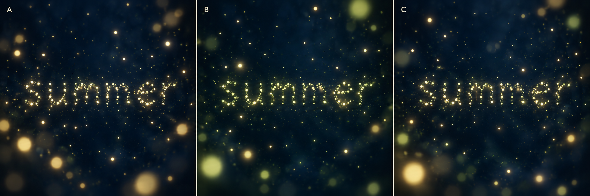

# Study 01 — summer-night palette comparison

Status: exploratory, not approved. Generated on 2026-10-06 using the built-in ImageGen tool.



## Variants

- A: warm ivory and pale gold, with subtle green-gold accents.
- B: pale green-gold, with warm ivory accents.
- C: a balanced mix of ivory, pale gold, and green-gold.

The comparison aims for similar composition and depth; generated particle placements differ, so it is not a controlled rendering experiment. The word `summer` is sample content, not selected website copy.

## Mentor review

The image communicates blue nocturnal space, layered light, and a readable particle word. Large foreground bokeh is rather prominent and overlapping halos reduce clarity in parts of the letters. After owner feedback, explore smaller or fewer foreground lights and more separation between letter particles. Still imagery does not validate living motion, interaction, or performance.

## Owner feedback

Pending. No variant has been selected.

## Generation prompt

```text
Use case: stylized-concept.
Asset type: one comparative art-direction moodboard for the poetic interactive project Creation, founding experience Fireflies.
Create ONE wide triptych image with three equal panels side by side, labelled A, B, C in small understated ivory sans-serif letters in the top left of each panel. Each panel repeats approximately the SAME composition, particle density and depth structure, so the palette can be compared. This is concept imagery, not website UI.
All three panels: abstract enveloping deep midnight-blue summer night, tender calm luminous organic mood. No realistic landscape, horizon, trees, moon, insects with anatomical wings, outer-space galaxy or spiral. The space should feel like warm summer air inhabited by living lights, not a star field. At the center of each panel the lowercase word "summer" is clearly legible, formed ENTIRELY by many individual small glowing firefly points, with loose organic spacing; no solid typographic letters, no connecting strokes. Preserve gaps between particles and letters. Most particles in the word are sharply defined with restrained soft halos. Sparse tiny subdued distant lights fill parts of the surrounding dark space; a few larger gently defocused foreground lights near the edges create immersive depth without blocking the word. Large amount of deep blue negative space, subtle depth haze, no bright fog curtains. Light cores stay delicate with no blown-out white clusters.
Panel A: predominantly warm ivory and pale golden lights with tiny subtle green-gold accents.
Panel B: predominantly delicate pale green-gold lights with warm ivory accents; organic bioluminescent and soft, never neon cyan or vivid lime.
Panel C: balanced varied warm ivory, pale gold, subtle green-gold, appearing as one coherent population; no rigid color assignment by depth.
Keep the three panels visually comparable and beautifully restrained. No title, logo, controls, frame mockup, or additional text except A B C and the particle word summer. The reference discussed by the owner informs the combination of tiny crisp points, luminous cores and soft halos, not its spiral, intense bloom or colors.
```
