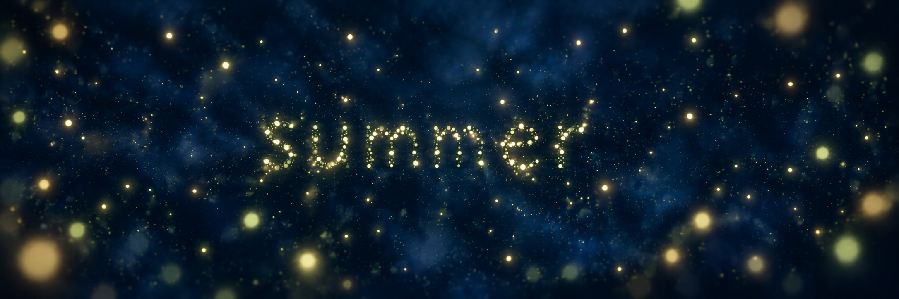

# Study 02 — direction C with deeper blue

Status: blue direction supported by the owner; nebula treatment rejected. Generated using built-in ImageGen on 2026-10-06, editing Study 01.



## Confirmed feedback on Study 01

The owner prefers C, but requests more deep enveloping blue to characterize a summer night. C is the selected palette direction; exact colors, density, bloom, and atmosphere remain adjustable.

## Owner feedback on this study

The deeper blue moves in the right direction, but there must be no nebula. The overall image is not approved.

## Intended change

Expand C into a single composition and strengthen the blue negative space while retaining the coherent ivory, pale gold, and green-gold population. The sample word summer is not selected website copy.

## Mentor review

Blue is more visible, but the generated atmospheric streaks and density suggest a nebula. Large foreground lights also remain prominent. A proposed next adjustment is simpler blue tonal depth without streaks, fewer tiny background points, and more discreet foreground lights. This diagnosis is a mentor proposal, not owner feedback. The image is not approved.

## Generation prompt

```text
Edit the supplied Fireflies palette triptych into ONE landscape concept study using ONLY the rightmost C panel as the selected visual direction. Remove the other panels, divider lines and A/B/C labels; expand C into a single immersive horizontal composition.
Main requested change: make deep enveloping BLUE SUMMER NIGHT much more perceptible and dominant throughout the negative space. The previous background was too nearly black and the warm particles dominated. Use rich dark midnight indigo and ultramarine-blue tonal depth, subtly graded atmospheric blue between and behind the lights. Keep it dark and serene, with a clearly blue identity, never electric blue, cyan, bright daylight or heavy milky fog.
Preserve C's coherent living-light family: warm ivory, pale gold, subtle green-gold with no rigid assignment by depth. Preserve the centered lowercase word "summer" made entirely of distinct individual light particles, its legibility, its organic loose spacing, and an abstract nonrealistic scene. Keep roughly the same delicate subject style, no insects with wings or scenery.
Contain bloom so warmth does not wash out the blue. Reduce the size and prominence of the largest foreground bokeh lights, keeping a few subtle defocused lights near edges for depth. Give blue space room to breathe around the word. Distant small subdued lights, sharper letter particles and restrained foreground softness. No stars with spikes, galaxy, spiral, landscape, horizon, moon, UI controls, titles or solid typographic lettering. This is a poetic concept study, not a production rendering.
```
