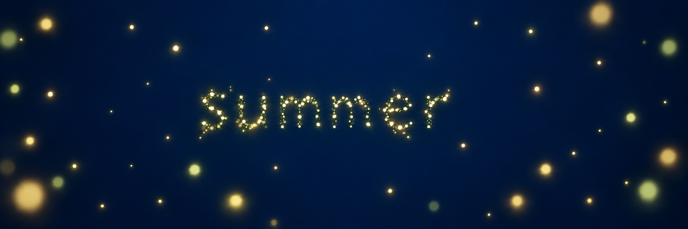

# Study 03 — quiet blue summer night

Status: exploratory; owner feedback pending. Created on 2026-10-06 with built-in ImageGen, editing Study 02.



## Confirmed feedback

The owner says Study 02 moves in the right direction for blue, but explicitly rejects nebula effects. Retain the C light family and the deep-blue direction; remove clouds and streaks.

## Mentor review

The output removes nebula-like texture and the dense background specks, leaving generous blue space. Depth comes from individual lights of varying sizes and focus. Large foreground lights and word density remain adjustable. This is a static concept, not a validated final design or demonstration of performance. The sample word summer remains placeholder content.

## Generation prompt

```text
Edit this Fireflies concept image. Main change: completely replace the nebulous background with a smooth deep BLUE summer-night background. Absolutely no nebula, gaseous clouds, smoke, fog, wispy texture, atmospheric filaments, luminous streaks, galaxy, cosmic dust or star-field texture. The backdrop is a simple velvety midnight indigo-blue color field, clearly blue rather than black, with only a very broad extremely subtle darker-at-edges tonal gradient. The blue must occupy most of the image and remain visibly rich and deep.
Preserve the centered lowercase word "summer" formed entirely from separate warm ivory, pale gold and subtle green-gold luminous particles; retain its organic typography and legibility. Preserve the coherent C color family and calm tender abstract summer-night mood. Maintain several depths of fireflies, but remove the dense carpet of microscopic specks: only sparse separate distant lights surrounded by generous empty blue space. Keep a few modest softly defocused foreground lights near the edges. Each halo must be local to its light, never merge into clouds or streaks. No landscape, horizon, wings, moon, interface, solid letters, labels or additional text. Target a minimal spacious blue night inhabited by fireflies. This is a precise background simplification, not an invitation to add scenery.
```
