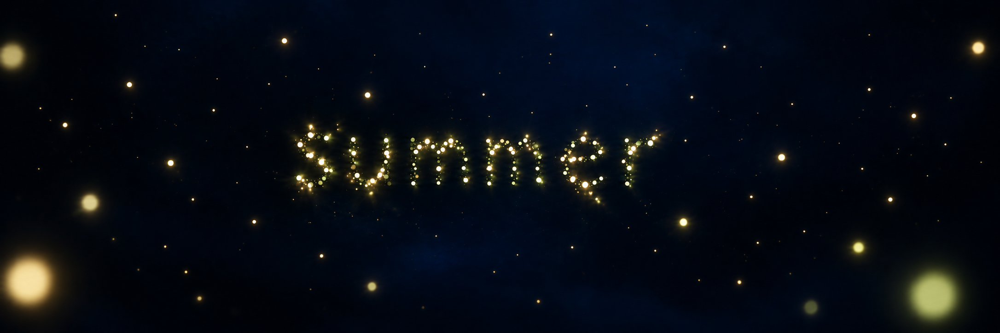

# Study 04 — deeper nocturnal space

Status: darker background direction supported; owner requests more foreground fireflies. Created with built-in ImageGen on 2026-10-06, editing Study 03.



## Owner feedback on Study 03

The blue is not deep enough and the result feels flat. The no-nebula constraint remains confirmed. A smooth blue field alone is not sufficient.

## Owner feedback on this study

The deeper result is better, but more foreground fireflies are desired for depth. The scene as a whole is not finalized.

## Proposed response

Use darker blue-black recesses alongside subdued deep-blue areas and stronger variation in light size, focus, and intensity. Maintain the C family of luminous colors. Spatial depth should come from the arrangement of living lights as well as the blue tonal structure.

## Mentor review

This output is darker, with more subdued distant lights and stronger foreground contrast. It tends toward near-black navy; the owner must assess whether enough blue remains visible. Large foreground disks remain present. No final background or density has been approved. Still imagery cannot demonstrate parallax or living motion.

## Generation prompt

```text
Revise the supplied Fireflies concept. The owner rejects its flat, insufficiently deep night. Keep the C palette of warm ivory, pale gold and subtle green-gold, and the centered readable lowercase "summer" formed entirely from separate light particles. Dramatically strengthen both nocturnal darkness and spatial depth.
Visual goal: the viewer feels INSIDE a deep dark midnight-blue volume, with living lights at many distances, rather than looking at lights laid on a flat blue backdrop. Rich very dark sapphire and ink-blue, with extensive almost-black NAVY recesses and selective subdued deep-blue areas. Darker than the reference, richer blue in the remaining visible midtones; no bright blue uniform wallpaper, no radial spotlight behind the word. Broad smooth asymmetric differences in blue luminance, without ANY visible cloud, gaseous texture, nebula, fog, smoke, wisps, streaks or galaxy. Clean empty darkness.
Depth: a continuous range of firefly sizes and luminance, many very fine distant pinpoints fading into blue-black darkness, medium well-defined varied glowing individuals in the word, and only 3 or 4 widely spaced soft foreground lights partially cropped near the edges. Foreground points should be much less numerous than in the reference, and their halos restrained. Place some tiny subdued lights far beyond the word and a few near lights off-center; use subtle overlap and focus separation to suggest long distances. Avoid evenly spaced lights, avoid huge flat opaque bokeh disks and dense cosmic dust carpets.
The letters themselves feel inhabited and subtly thick in depth, with small variations in focus and intensity, but remain immediately legible, not made of solid glowing strokes. Preserve ample negative space and calm poetic abstract summer-night mood. No anatomy, landscape, moon, stars with spikes, horizon, UI, labels or additional text. Beautiful restrained cinematic depth with delicate warm local glows floating in profound blue darkness.
```
