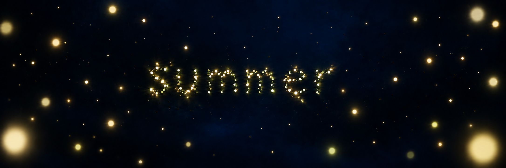

# Study 05 — richer foreground

Status: exploratory; owner feedback pending. Created with built-in ImageGen on 2026-10-06, editing Study 04.



## Owner feedback on Study 04

The deeper background is better. The owner prefers more foreground fireflies, which also contribute to depth. Preserve the dark-blue direction and no-nebula constraint while restoring nearby lights.

## Mentor review

More nearby lights are present and the particle word remains unobstructed. The two large lower lights create a somewhat symmetrical frame despite the intended irregular distribution; their arrangement remains adjustable. Added lights are predominantly warm, so the exact foreground color balance is also open. Still imagery cannot validate living motion or parallax. This is not a final approved scene.

## Generation prompt

```text
Edit the supplied Fireflies Study 04. Change ONLY the foreground firefly population: the owner likes this darker deep-blue background and depth direction but wants more nearby fireflies, as in the earlier richer foreground.
Keep the existing deep midnight navy/ink-blue background, its subtle tonal variations and near-black recesses. Keep the no-nebula condition: absolutely no gaseous clouds, smoke, wisps, bright fog, cosmic streaks or galaxy. Preserve the centered lowercase word "summer" made entirely from distinct luminous particles, its size, organic form, legibility and position. Preserve the fine distant fireflies and the C family of warm ivory, pale gold and subtle green-gold.
Add about 8 to 12 additional nearby lights with a CONTINUOUS range of sizes and focus. Some medium-near lights have an identifiable small luminous core and a soft halo, some very close lights are gently defocused and larger. Scatter them asymmetrically around the word, mostly in the outer thirds, some cropped at the frame edges, a few at intermediate distance. No rigid border, no evenly spaced pattern, no symmetrical framing. Leave substantial uninterrupted dark-blue gaps and keep all letters unobstructed.
Nearby lights should feel like separate living presences in the same 3D volume, not flat opaque yellow disks or giant decorative bokeh. Keep warm ivory/gold/green-gold variety within the foreground. Preserve overall dark exposure: added halos must stay localized and must not brighten or flatten the blue night. Do not change typography or add UI, scenery, labels, solid text, anatomy or new objects. A tender immersive abstract summer night surrounded by fireflies.
```
