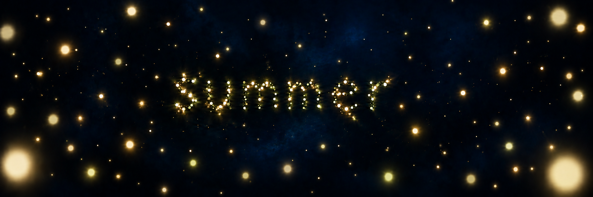

# Study 06 — discreet blue veil and fuller foreground

Status: exploratory; owner feedback pending. Created with built-in ImageGen on 2026-10-06, editing Study 05.



## Owner feedback on Study 05

The foreground still feels too empty. The owner requests more near lights and asks to test a more discreet nebula. The previous absolute no-nebula constraint is reopened for exploration; this does not approve a final nebula treatment.

## Intended changes

Retain the deep dark blue and C light family. Add a restrained recessed blue atmospheric veil and a richer population at near and intermediate-near distances. Keep the sample particle word readable.

## Mentor review

The scene has more intermediate and nearby lights, with subtle blue texture behind them. The two large lower lights still create symmetry, and the veil remains a visual treatment to assess with the owner. Exact foreground density, distribution, halo softness and atmospheric intensity are not finalized. This still is not a performance or motion demonstration.

## Generation prompt

```text
Edit the supplied Fireflies Study 05 with TWO requested changes: a VERY DISCREET deep-blue nebula-like atmospheric veil, and a SIGNIFICANTLY richer nearby firefly population.
Preserve the existing dark midnight navy/ink-blue exposure, near-black recesses, coherent warm ivory/pale gold/subtle green-gold family and centered lowercase particle word "summer", its scale and immediate legibility. Calm poetic abstract summer night.
Background: add only a faint low-contrast broad indigo-blue veil in a few recessed areas BEHIND the lights. Almost subliminal, visible on close viewing, no bright swirling filaments, no white or cyan clouds, no dramatic galaxy, spiral, stars with spikes or outer-space spectacle. Maintain most of the deep dark blue negative space. This is a test of subtle atmosphere rather than a dominant cloud subject.
Foreground: populate a real continuous volume with about 25 additional near and intermediate-near fireflies. This increase must be clearly visible compared with the reference. Many are medium sized with small luminous cores and soft local halos, a handful are closer and gently defocused with broader translucent halos. Mix warm ivory/gold/green-gold nuances. Distribute them irregularly across upper, lower, left and right regions and intermediate areas around the word; do NOT arrange them in a decorative edge border or match the two bottom corners symmetrically. A few cropped nearby lights, many smaller near lights to bridge foreground to text depth, subtle overlaps away from the letters. Retain distant fine points. No giant opaque bokeh disks, dense dust carpet or uniformly sized glowing dots. Ensure the center word remains completely legible and none of its letters is blocked.
The scene should feel inhabited and enveloping, with more to explore in the foreground while still dark and breathable. No landscape, horizon, insects with wings, UI, labels or solid typography.
```
