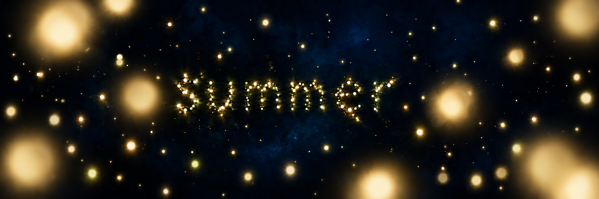

# Study 07 — foreground proximity blur

Status: exploratory; owner feedback pending. Created using built-in ImageGen on 2026-10-06, editing Study 06.



## Request

The owner accepts exploring the proposed combination and asks to see the actual result: retain the dark-blue discreet-veil background and restore larger softly defocused near fireflies, while preserving readable particle text and intermediate-distance lights.

## Mentor review

The proximity blur is clearly visible and the word remains readable. Very large near lights are dominant; several retain a relatively bright filled center. Their color is predominantly golden despite the intended mixed family. This is useful as a strong focus/size exploration, not a final selected balance. Consider moderating intensity and restoring more foreground color nuance based on owner feedback. No motion or performance is validated by this still.

## Generation prompt

```text
Edit the supplied Fireflies concept to clearly show the foreground proximity blur previously discussed. This is the actual visual result the owner requests.
KEEP the deep enveloping dark blue summer-night background and its VERY DISCREET blue veil exactly in the existing visual spirit. Keep the C light family: warm ivory, pale gold, subtle green-gold. Keep the centered lowercase "summer" fully readable and entirely made from separate living light particles, the fine distant lights, and the richer intermediate-distance population.
CHANGE the foreground size/focus distribution substantially. Replace the matching pair of large lights in the bottom corners with an irregular asymmetrical collection of 7 to 10 VERY NEAR firefly lights scattered at differing positions and sizes. They are clearly LARGER and MUCH MORE DEF0CUSED than the medium lights: soft, feathered translucent luminous presences with no hard circular rim, no sharply resolved core, like fireflies passing just in front of a focused camera. Some gently overlapping soft halos away from the word, 2 or 3 partly cropped by top or side edges. Include one very close soft light slightly inside the frame on one side of the word, not just a decorative edge border, leaving the letters unobstructed. Spread them across upper, lower, left and right areas with unequal spacing, never a symmetric frame.
Create a continuous focus progression: near lights visibly very blurred, intermediate lights softly resolved with a core, word particles well-defined, far lights tiny and subdued. Preserve deep dark-blue gaps between local warm glows; soft blur should suggest proximity without blowing out exposure or becoming pale fog. The overall image must feel like the viewer is WITHIN the swarm. No galaxy, pronounced nebula, bright cloud streaks, landscape, anatomy, UI, labels, or extra text. Beautiful quiet cinematic depth-of-field, intimate warm lights in deep summer blue.
```
