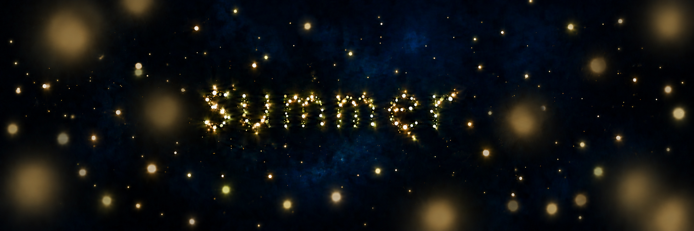

# Study 08 — restrained foreground light

Status: owner finds intermediate-distance fireflies too luminous; final balance remains open. Generated with built-in ImageGen on 2026-10-06, editing Study 07.



## Owner feedback

Study 07 is too luminous. The owner reminds us that there will be surrounding "UP", interpreted by the mentor as UI. Exact interface content and layout remain undecided.

## Intended adjustment

Retain the large nearby fireflies and proximity blur, but substantially reduce their brightness and opacity so the blue remains visible and the word can take priority. Keep quiet areas for future interface composition without introducing unrequested controls or selecting a layout.

## Owner feedback on this study

Intermediate-distance fireflies are too luminous. The owner requests explicit senior design critique and recommendations.

## Proposed luminous hierarchy

Reduce the sustained brightness and halo spread of most intermediate lights. Keep their cores small and their intensities varied; allow occasional brighter presences rather than equally bright points everywhere. Preserve the large soft near lights without using strong brightness as the only depth cue. Review the particle word as well: it should remain legible without becoming a uniformly overexposed dotted sign. Evaluate the interface, word, and living scene together in a later composition. Motion and momentary pulses may support living behavior, but their exact choreography remains open.

## Mentor review of the generated image

The large soft lights are visibly dimmer and the word has more prominence. Foreground color remains mostly warm gold and can be adjusted. The image alone does not establish UI contrast or accessibility: evaluate with the actual interface, responsive compositions and moving lights. No exact numeric exposure reduction is verified from the generated image.

## Generation prompt

```text
Edit the supplied Fireflies Study 07. Main change: substantially LOWER the brightness and opacity of the large blurred foreground fireflies so the scene can accommodate a readable interface.
Preserve the number, approximate sizes, spatial depth and very soft proximity blur of the large near lights. Do not remove the nearby population or make it small again. Reduce perceived brightness of the large defocused lights by approximately two thirds: deep muted gold, subdued warm ivory and delicate green-gold, translucent feathered halos with dark blue visibly showing through them; no bright cream/yellow filled centers, no white-hot bloom, no flat opaque glowing disks. Their soft shapes should still be recognizable against the night but they should not dominate the particle word.
Keep the current rich dark midnight-blue background and very discreet blue veil. Maintain the exact sample lowercase particle word "summer", its organic form, central position and legibility, distinct small luminous particles and a continuous focus/size progression through nearby, middle and far fireflies. The word may retain more luminance than the blurred near lights. Added green-gold and ivory nuances in the foreground should remain one coherent color family.
Preserve calm dark breathing space near the outer margins and upper/lower areas for future UI. Do not invent or draw any interface, labels, buttons, typography or layout zones: their positions are not yet decided. The image is still an art-direction study. Keep an irregular arrangement and avoid symmetrical framing. Maintain night, depth and warmth with restrained localized light. No pronounced nebula, cloudy bright fog, scenery, moon or additional text. Change brightness and translucency, not the fundamental composition.
```
