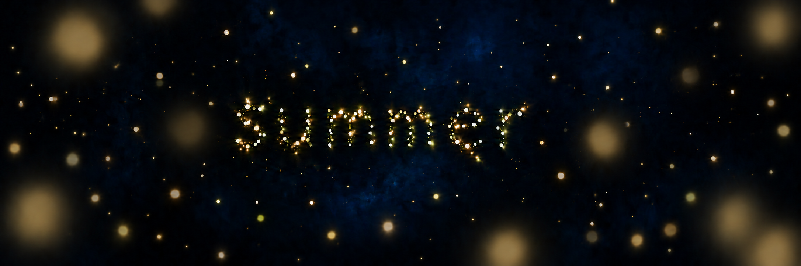

# Study 09 — refined luminous hierarchy

Status: exploratory; owner feedback pending. Created with built-in ImageGen on 2026-10-06, editing Study 08.



## Accepted design directions

Reduce most intermediate fireflies' brightness and halo spread; vary their intensities; retain large restrained proximity-blurred near lights; separate word particles more clearly. Preserve deep blue, the discreet veil, the C light family and layered richness. The owner authorized one further targeted image before interface composition. This does not approve the resulting image.

## Mentor review

Intermediate lights are more subdued and the word remains the visual focus. Some horizontal smears between word particles persist despite the prompt, so particle separation is only partially achieved. The generated still does not establish numeric brightness reductions. The mentor recommends using this as a candidate atmosphere baseline for interface composition, leaving final lighting and particle separation open. Motion, responsive layout, readability with controls, and performance remain unvalidated.

## Generation prompt

```text
Edit the supplied Fireflies Study 08 into a refined summer-night art-direction study.
PRESERVE: rich enveloping deep midnight-blue and near-black blue recesses, the existing very discreet blue veil with no increase in cloud prominence, large nearby softly defocused lights with their already restrained luminosity, abundant but breathing layered firefly population, C color family of warm ivory, pale gold and subtle green-gold. Preserve the centered lowercase sample word "summer", its size, placement and immediate legibility. No UI yet.
MAIN CHANGE 1: most INTERMEDIATE-distance fireflies outside the word are TOO BRIGHT in the reference. Reduce the perceived sustained brightness of about 80 percent of these middle-size points by roughly half to two thirds; reduce their halo radius substantially. They should have small delicate muted warm cores, not white-hot centers. Retain the same approximate number and distribution, so the space stays inhabited rather than empty. Vary brightness strongly across individuals, with only a handful of occasional brighter accents. The near large blurred lights should remain softly visible as in the reference, not be shrunk or removed. Distances should feel continuous through focus and size variation.
MAIN CHANGE 2: separate the word particles. Remove all faint connecting streaks, horizontal smears and glowing bridges between dots. The lowercase word "summer" must be clearly readable but entirely composed of distinct individual fireflies separated by small dark gaps. Each letter is a loose organic inhabited formation with small variations in size and light intensity, not a neon sign or continuous dotted light tube. Slightly restrain the word's overall bloom too, preserve clarity through spacing. No solid typographic strokes.
Composition: calm luminosity hierarchy; the word carries attention, surrounding life is discreet, deep-blue negative space remains rich. Reserve breathable quiet areas for later interface composition without adding interface or selecting a layout. No additional text, labels, moon, landscape, wings, pronounced nebula, galaxy or decorative star spikes. Maintain tender immersive summer night and meaningful foreground proximity blur.
```
