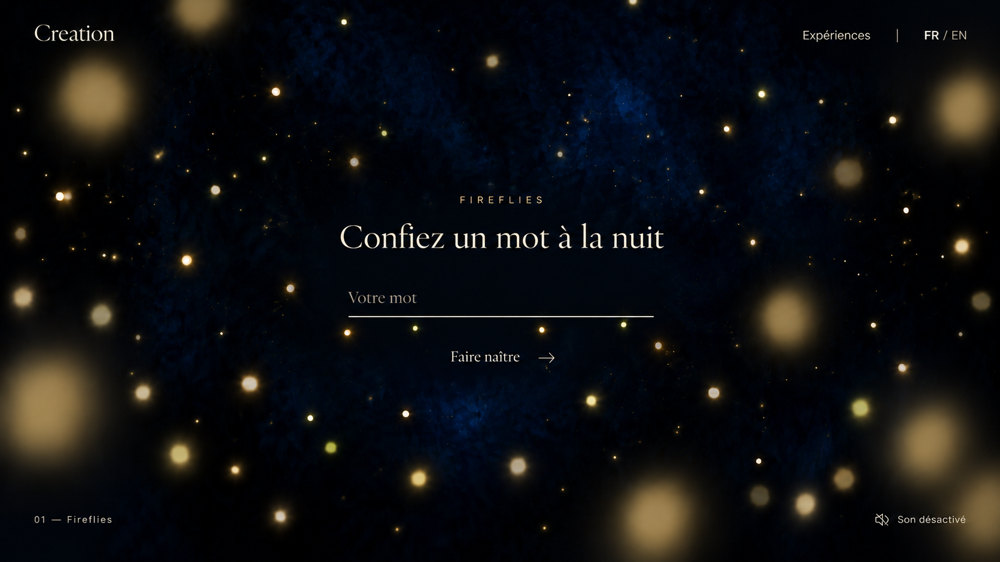

# Study 10 — Fireflies entry interface

Status: first interface proposal; owner feedback pending. Created with built-in ImageGen on 2026-10-06 using Study 09 as atmosphere reference.



## Accepted foundation

Bilingual French/English website; shared adaptive Creation interface; Study 09 atmosphere baseline. The owner accepts exploring a bottom-line input with a few small nearby fireflies and the proposed entry interaction.

## Proposed composition

French entry state, before word formation. A temporary Creation typographic wordmark, experience title, short invitation, underline-only word input, explicit submission, experience navigation, language choice and sound control. Exact copy, typography, control inventory, layout and logo are not approved. Navigation and sound controls are proposed, not implemented features.

English invitation proposed for later comparison: Give a word to the night. Actual translation and language behavior remain to design.

## Mentor review

The input and submission are identifiable and the overall hierarchy is clear. The image generator increases the blue veil and some light intensity relative to the accepted atmosphere, which should be brought back toward Study 09. Small lights under the rule are too evenly distributed; intended motion should be irregular and organic. Creation is a typographic study, not a finalized logo. Focus, typing, submission transition, touch behavior, contrast during motion and responsive layout remain unvalidated.

## Generation prompt

```text
Use case: ui-mockup. Edit the reference into a polished desktop ENTRY-STATE concept mockup of Fireflies in the poetic website Creation. Produce a single 16:9 landscape screen with no browser/device frame.
Reference role: approved atmosphere baseline. Preserve deep enveloping midnight blue, discreet recessed blue veil, subtle warm ivory/pale gold/green-gold living lights, subdued intermediate luminosity and large softly defocused foreground lights, with dark space for readable UI. Remove the particle word "summer" COMPLETELY: the visitor has not entered a word yet. Place a few scattered tiny living lights where that formation used to be, leaving central breathing space.
Art direction: quiet editorial elegance, intimate organic summer-night immersion, restrained brand presence. Finely crafted typography, warm ivory text at readable contrast against dark blue. No glass cards, bright panels, large button pills, gradients in text, or generic dashboard decoration.
Proposed layout, not a finalized brand: top left small wordmark "Creation" in a refined contemporary serif, with generous outer margins. Top right understated sans-serif text navigation "Expériences" and language selector "FR / EN", French active. Keep controls modest but readable, not hairline microscopic.
Center: a small elegantly spaced eyebrow "FIREFLIES"; underneath, refined medium-large serif invitation text exactly "Confiez un mot à la nuit". The invitation is one concise line, not an enormous hero headline. Below with generous spacing is an UNDERLINE-ONLY text input about a third of screen width: standard simple readable muted-ivory placeholder "Votre mot", no box or panel. One fine subdued ivory bottom rule; a few (around 5) tiny pale-gold/green-gold fireflies hover just around and slightly beneath its line, loose organic spacing, no orbit rings, loading spinner or trails. Keep the letters and line readable. Their scale should be much smaller than near foreground lights. Input is central within screen, not at viewport bottom.
Under the line a small explicit text action "Faire naître" accompanied by a delicate right arrow. No brightly filled button. This is a proposal for discoverable submission, not finalized copy. Sparse unobtrusive bottom-left label "01 — Fireflies"; bottom-right quiet sound control labelled "Son désactivé" with a small simple icon. All UI is crisp and sharply rendered, distinct from particle blur. Foreground glows must not overlap UI text. Exact text only as specified, no additional slogans, explanatory paragraphs, logos, anatomy, moon, landscape or pronounced nebula. The result should communicate that entering a word is the first poetic interaction.
```
