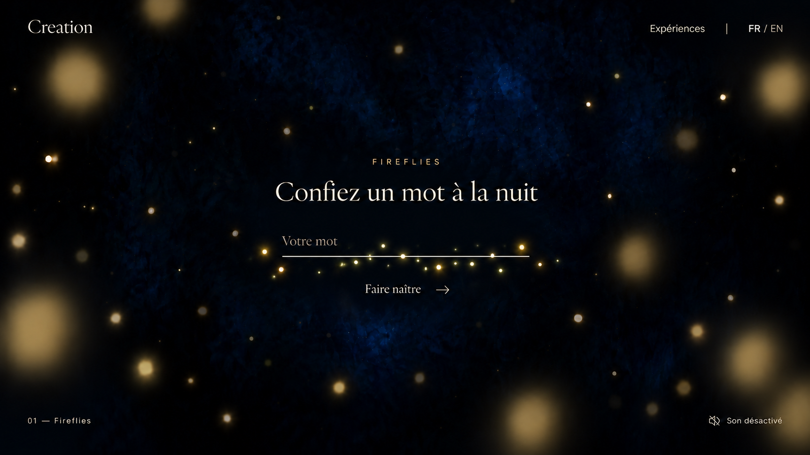

# Fireflies — input-axis direction

Status: owner-supported entry composition. Built-in image generation, October 6, 2026.

Small lights surround the input's fine bottom rule as a horizontal axis, in shallow depth, with
varied phases/positions and no drawn tracks. Concentrate entry activity here while leaving the
editable letters and controls unobstructed.

The image only suggests orbits; it does not validate movement. Its veil/light intensity is stronger
than the atmosphere baseline: defer to study 09 for rendering balance. Public copy, exact control
layout and supporting typography are provisional. See
[interface direction](../../../docs/interface-direction.md).
