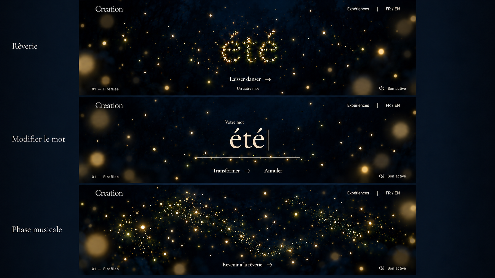

# Fireflies — single-word states

Status: owner-approved visual direction. Built-in image generation, October 6, 2026.

One word occupies the same scene location and perceived scale across living particles and editable typography. Preserve deep blue and dim large near lights. The musical panel expresses a moving multitude, not a predefined wave choreography.

## Required corrections during implementation

- Match the actual glyph silhouettes/widths/position between typography and particles; the generated particle word is wider.
- Correct the crossed-out sound icon beside Son activé.
- Reduce bright intermediate lights where needed to preserve study 09's hierarchy.
- Use actual desktop viewport compositions; these panoramic strips are not a responsive specification.

Static images do not validate formation, input orbits, audio reaction or interaction suspension during editing. See [the storyboard](../../../docs/experiences/fireflies-storyboard.md) for authoritative behavior and [branding](../../../docs/branding.md) for the real font.
