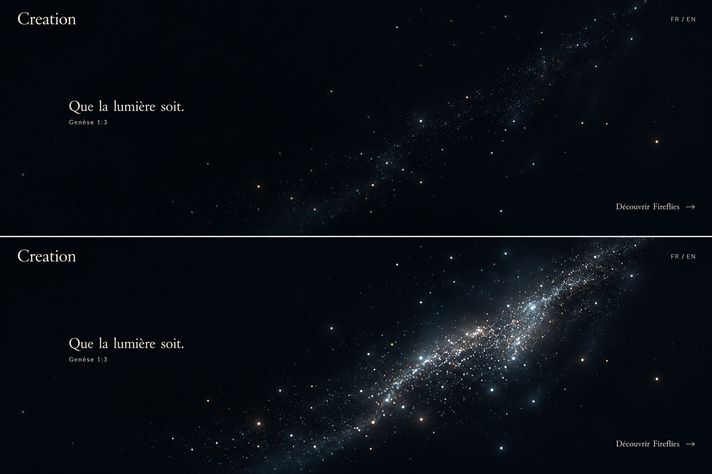

# Intro — celestial veil visual target

Status: approved specific visual target, not just loose inspiration.

Preserve the composition, colors, density, depth and illuminated-state balance. A faint layered dust
band in deep ink-blue darkness becomes locally illuminated under gesture. The veil arrives
discreetly; text also enters with animation. No fireflies, bright nucleus, realistic landscape or
earthly mist.

Created with built-in image generation using the
[supplied particle screenshot](../fireflies/references/01-luminous-particles.jpg) for material/depth
only. Generated states are approximate stills, not validated motion or measured 60 fps. Point
sprites/soft dust layers and a gesture intensity field are a plausible construction, not a required
shader technique.

The image's verse excerpt is superseded by complete Genesis 1:3 in the
[intro specification](../../docs/experiences/intro.md). Current typography/provisional C follows
[branding](../../docs/branding.md). Review exact rendering, interaction, verse layout and transition
timing during implementation.
